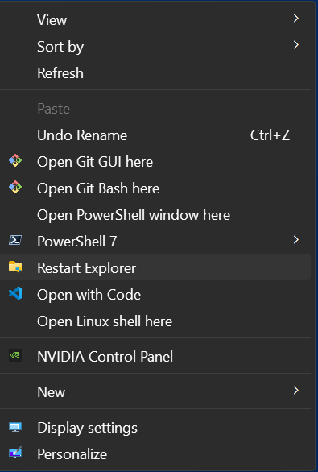

# Restart Explorer Context Menu

!!! github "View Repository on GitHub"
    [Restart Explorer Context Menu](https://github.com/ConglomoUS/Restart_Explorer_Context_Menu) — Check out the Repository on GitHub for the Latest Download.

## What Does the Registry File Do?

The `Restart_Explorer_Context_Menu.reg` file adds a new option to the Windows context menu when you right-click on the desktop background. This option, labeled "Restart Explorer," allows you to quickly restart the Windows Explorer process. 

- **Registry Key Added**: It creates entries under `HKEY_CLASSES_ROOT\Directory\Background\shell\Restart Explorer` to define the menu item.
- **Icon**: Sets an icon for the menu item using `%SystemRoot%\System32\imageres.dll,-3`.
- **Command**: Under `HKEY_CLASSES_ROOT\Directory\Background\shell\Restart Explorer\command`, it specifies the action to be performed. The command runs `cmd.exe` to forcefully terminate the `explorer.exe` process and then restart it.

This is useful for troubleshooting or refreshing the Explorer interface without rebooting your system.

## Instructions

### Installation

In the [repo](https://github.com/ConglomoUS/Restart_Explorer_Context_Menu), find the latest release and download the `Restart_Explorer_Context_Menu.reg` file

Launch it, then right click the desktop, (Or Shift Right Click if you have the modern context menu). Select Restart Explorer

### Uninstallation

Need to remove? Just run the `Uninstall_Restart_Explorer_Context_Menu.reg` file to remove.

